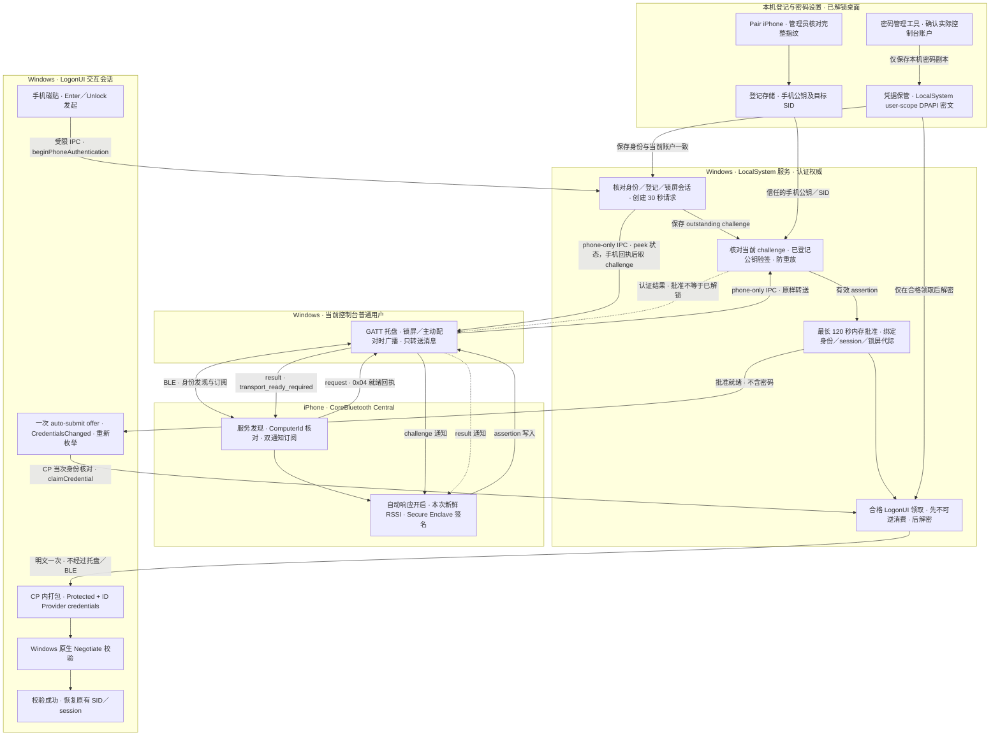

<!-- Created by Rui MA on 03 Oct 2026 -->

# 跨端协议与整体架构

本文是 iPhone 与 Windows 当前协议的共同说明；签名协议版本为 v1。平台实现分别位于 [iOS UnlockProtocol](ios/Core/UnlockProtocol.swift) 和 [Windows Protocol](windows/Protocol/README.md)。JSON 是传输外壳，不是实际签名输入。

范围是**已有物理控制台会话的锁屏解锁**。重启／注销后的首次登录使用原生 PIN／密码；登录后托盘以普通用户权限运行，锁屏时才广播，桌面主动配对窗口为例外。本文描述代码职责与合同，不将后台整夜、完整配对或负面路径视为已验收；状态见 [Windows 验收记录](windows/Validation.md) 和 [iOS 验收要求](ios/README.md#acceptance-after-explicit-buildtest-authorization)。

## 整体架构流程图



安装器部署服务、CP、托盘及管理工具，注册目标用户 Run，并负责更新／卸载和重启续办；不参与手机签名或密码认证。部署名称以 [共享组件清单](windows/ComponentFiles.h) 为准，操作见 [安装器文档](windows/ComponentsWizard/README.md)。

## 身份与信任边界

- Windows 只登记一份手机 P-256 公钥及目标账户 SID。登记在已解锁桌面由用户主动开启，经管理员确认完整指纹；同手机同账户不重写，不同手机必须明确确认替换。取消或失败不静默覆盖原记录。
- iPhone 私钥保存在 Secure Enclave，采用 `AfterFirstUnlockThisDeviceOnly`。签名证明登记私钥可用，不证明用户此刻解锁了手机；手机重启后首次解锁前密钥可能不可访问。
- `ComputerId` 是目标定位标识，不是密码学服务器身份；peripheral UUID 只是连接缓存，名称只是展示。名称相同不能替代 ComputerId 核对，ComputerId 也不能替代 Windows 的公钥验签。
- 保存密码绑定目标 SID、系统原样的 QualifiedUserName 和 ProviderID；CP 每次重新枚举核对 PrimarySid＝SID。相同 SID 但在线身份变化不得领取旧密码。管理工具的提权管理员不是保存目标，目标来自实际物理控制台。
- 服务是请求、期限与批准的权威。托盘无权提交一个可直接信任的 approved 字符串，不持有密码；phone pipe 不提供凭据领取。
- IPC 按操作核对实际客户端 token、会话和账户。LogonUI 操作还核对进程映像、SYSTEM 身份及持有的进程句柄；客户端模拟结束并恢复 LocalSystem 后才执行 DPAPI。该边界不声称抵御已控制 SYSTEM 的攻击者。

## 请求与一次性批准

1. 已有锁定会话中，用户按 Enter／Unlock，CP 发起 `beginPhoneAuthentication`。选择磁贴或刚锁屏本身不创建请求。
2. 服务核对 CP 当前身份、保存身份、登记 SID 和锁屏会话，生成随机 requestID、32 字节密码学随机 nonce 及服务时间戳。整次认证等待期限为 **30 秒**；服务的单调时钟 deadline 决定内部剩余时间。
3. 托盘通过 `peekPhoneAuthentication = 17` 查询状态，选定唯一同时订阅 challenge／result 的连接，定向发送准备消息。手机完成 ComputerId 核对和双订阅后回执；托盘重新检查连接、当前 requestID、订阅与期限后，才调用 `takePhoneChallenge` 单次领取并投递。查询和准备消息不消费 challenge。
4. iPhone 核对目标、自动响应偏好及 challenge，读取本次新鲜 RSSI。读数／签名窗口为 **3 秒**，默认阈值为 **−60 dBm**，用户可调；不复用历史读数，签名后的 Windows 结果等待不是 RSSI 超时。RSSI 不承诺固定距离，也不构成防中继的密码学距离证明。
5. 服务从 outstanding challenge 重建签名字节，核对 requestID、版本、有效期、登记公钥与指纹并验签、防重放；challenge 的 audience／nonce 来自服务当前请求，而不是信任 assertion 自报。
6. 有效结果建立最长 **120 秒**、绑定完整保存身份、console session 与锁屏代际的内存 grant。服务重启、期限届满或真实解锁／会话变化使旧请求及批准失效。管理界面的五分钟身份快照不是批准，也不决定当次 CP 领取资格。
7. 服务只向合格 LogonUI 发出一次自动提交 offer；CP 调用 `CredentialsChanged()`，重新枚举后自动提交。首次合格 `claimCredential` **先不可逆消费 grant，再解密并释放密码**。打包失败、Windows 拒绝密码或 CP 重建不会恢复该批准；再次尝试需新手机批准。
8. CP 在 LogonUI 会话内执行 `CRED_PACK_PROTECTED_CREDENTIALS | CRED_PACK_ID_PROVIDER_CREDENTIALS` 打包，提交原生 Negotiate。服务不在 Session 0 预打包，CP 不直接调用 `LsaLogonUser` 或构造 token；只有 Windows 校验成功才真正解锁。

30 秒请求、3 秒手机处理、120 秒领取和五分钟管理快照是不同阶段，不能互相替代。原生 PIN／密码入口始终保留。

## Challenge JSON 与签名字节

```json
{
  "audience": "windows-unlock",
  "issuedAtMilliseconds": 0,
  "nonce": "<base64: 32 bytes>",
  "requestID": "<UUID>",
  "version": 1
}
```

`issuedAtMilliseconds` 为服务生成的时间戳。字段顺序、JSON 标点及 Base64 文本不参与签名；两端使用以下固定二进制载荷：

```text
ASCII("unlock-windows-with-iphone/v1") || 0x00 ||
UInt32BE(version) ||
requestID[16 bytes, RFC 4122 order] ||
nonce[32 bytes] ||
Int64BE(issuedAtMilliseconds) ||
UInt16BE(audienceUTF8ByteLength) ||
audienceUTF8
```

`BE` 表示大端字节序。iOS CryptoKit 对载荷进行 SHA-256／ECDSA P-256 签名；Windows CNG 对相同载荷计算 SHA-256 后验证。上下文前缀用于区分协议用途，固定编码避免不同 JSON 库的字段顺序及转义差异。

## Assertion JSON

```json
{
  "keyID": "<lowercase hex SHA-256 of publicKeyRawRepresentation>",
  "publicKeyRawRepresentation": "<base64: 65-byte uncompressed P-256 X9.63 key>",
  "requestID": "<same UUID as challenge>",
  "signatureRawRepresentation": "<base64: 64-byte r || s ECDSA signature>",
  "version": 1
}
```

公钥原始格式为 `0x04 || X[32] || Y[32]`；签名为定长 raw `r[32] || s[32]`，不是 DER。iOS 输出小写指纹，Windows 校验十六进制并规范化大小写比较。必须同时匹配本地已登记公钥，不能因为 assertion 附带公钥与签名自洽就信任它。

## 当前 BLE 合同

Windows 为 GATT Server，iPhone 为 CoreBluetooth Central。服务 UUID：`F1E2D3C4-B5A6-4789-8012-3456789ABCDE`。

| 特征 | UUID 末段 | 方向／属性 | 当前用途 |
|---|---|---|---|
| request | `3456789ABCD1` | iPhone → Windows，Write With Response | 登记帧／就绪回执／当前请求的失败报告；不创建认证请求 |
| challenge | `3456789ABCD2` | Windows → iPhone，Notify／Read | 完整 challenge JSON |
| assertion | `3456789ABCD3` | iPhone → Windows，Write With Response | 完整 assertion JSON |
| result | `3456789ABCD4` | Windows → iPhone，Notify／Read | 关联本次认证或登记的结果 |
| ComputerId | `3456789ABCD5` | Windows → iPhone，Read | 36 字符 UTF-8 非零 UUID；核对持久目标 |

各特征的完整 UUID 均使用前缀 `F1E2D3C4-B5A6-4789-8012-` 加表中末段。

- 登记帧：`0x02 || publicKey[65 bytes]`，共 66 字节；仅主动配对窗口接收。
- 就绪回执：`0x04 || requestID[36 lowercase ASCII bytes]`，固定 37 字节；只接受已发送准备消息的选定连接和当前未过期请求。
- 手机失败帧：`0x03 || requestID[36 ASCII bytes] || reason[1 byte]`，共 38 字节；必须来自本次认证连接并关联当前 requestID。
- 手机可报告的原因：`1` 距离读数不足、`2` 自动响应关闭、`3` 新读数不可用、`4` 连接／订阅失效、`6` 签名失败。`5` 为 Windows 投递失败的内部报告，不是当前手机 request 帧接受的原因。
- 旧 `0x01` 手机请求 challenge 不再支持。认证从 CP 发起，经本地 phone-only IPC 转送，不新增另一套认证入口。
- ComputerId 持久化在目标用户的 `HKCU\Software\UnlockWindowsWithIPhone\GattHost`。Windows 停止发布不主动断开物理连接，但远端服务可能消失；iPhone 在原连接限时重新发现，确认缺失后串行断开并等待指定服务的广播，再重新核对 ComputerId 和双订阅。已有有效 ComputerId 和公钥无需重新登记。

### 手机就绪确认

准备消息经 result characteristic 定向发送，每秒最多一次：

```json
{"authenticated":false,"status":"transport_ready_required","requestID":"<current UUID>"}
```

iPhone 初始化期间最多暂存一条准备请求，完成身份核对与双订阅后才写入 `0x04` 回执。准备消息不批准解锁、不签名、不进入登记或解锁成功逻辑；提前到达的 challenge 被拒绝并记录。断连、服务失效、停止发布、用户切换、睡眠、配对及请求结束清除准备状态；旧回执不能使新请求就绪。重复回执不会重复领取或批准。

phone-only IPC 的 `peekPhoneAuthentication = 17` 接收空 payload，返回现有 `AuthenticationStatus`，不包含 challenge，也不修改投递标记；仍须通过当前控制台、SID、会话及锁屏检查，其他 IPC 端点拒绝。`takePhoneChallenge` 格式保持不变。准备、恢复与回执共用服务原始 30 秒期限，不延长请求、不自动签发新请求。两端须使用匹配版本，无旧协议兼容分支。

Windows 广播使用目标、实际 WinRT 状态和在途启停三种独立状态；操作期限五秒，启动失败或中止最多按 1／2／4 秒重试三次。解锁、睡眠和退出取消待重试；新的锁屏周期重建预算。iOS 初始化仍为十秒与一次主动重试，确认服务缺失后不立即连接缓存设备、不循环重启扫描；新的有效广播发现、前台恢复或明确重试可开启新周期。

2026-10-03：上述修复已写入源码并补充回归用例，尚未构建、执行测试或完成双端实机验收。用户日志已观察到解锁成功后服务失效并长期等待；广播中止的底层原因和此前后台恢复失败的完整事件顺序仍未确认。

协议层只处理完整逻辑消息；截断或解析失败必须拒绝。底层 MTU、发现及状态恢复不改变上述签名字节，也不能被宣称为已经完成的应用分片支持。

## 结果与拒绝语义

认证结果示例：

```json
{
  "authenticated": true,
  "status": "unlock_approved",
  "requestID": "<current UUID>"
}
```

`unlock_approved` 只表示服务建立了批准，不表示 Windows 已解锁。登记结果使用 `authenticated: false` 及 `enrollment_*` 状态；不能把它当作认证失败或解锁成功。保存后服务重载失败可另带 `detail: "saved_reload_failed"`，不得显示完整登记成功。

必须拒绝过期／重放、requestID 不匹配、无登记／错误公钥、无效签名／消息、错误账户／会话、首次登录、未锁屏及不合格调用方。距离不足、无读数、断连、等待超时、服务不可用与真实会话变化各自报告，不用同一句 session changed 掩盖全部失败。拒绝不能切换身份、恢复已消费授权或退回软件私钥。

诊断记录阶段、耗时、订阅状态和允许的结果码，不记录密码、nonce、密钥或签名正文。详细接口及各自操作约束见 [GATT host](windows/GattHost/README.md)、[保存凭据服务](windows/SavedCredential/README.md)、[Credential Provider](windows/CredentialProvider/README.md) 和 [iOS 状态机](ios/README.md)。
