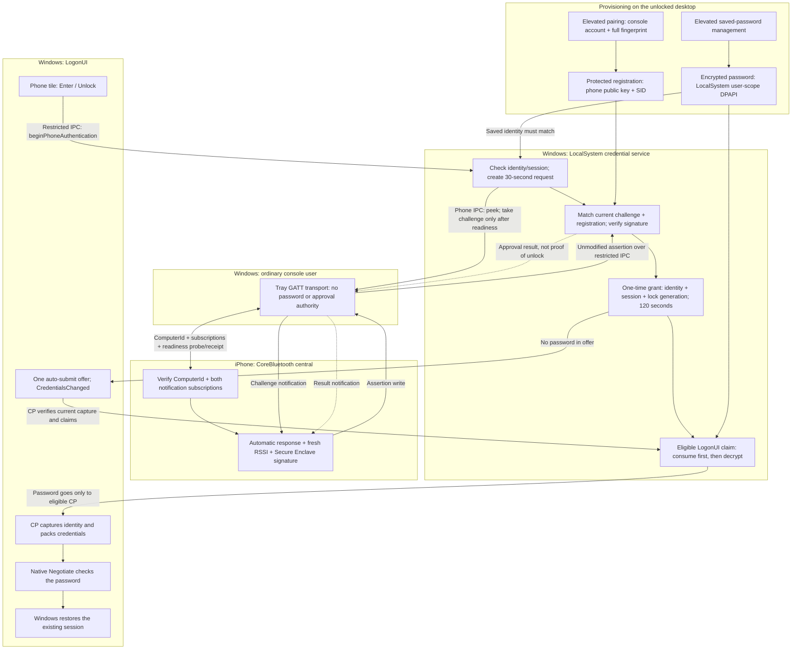

<!-- Created by Rui MA on 03 Oct 2026 -->

# Protocol and architecture

This document defines the current iPhone–Windows protocol, signing version **v1**, and the overall trust boundaries. Implementations are [iOS UnlockProtocol.swift](ios/Core/UnlockProtocol.swift) and the [Windows Protocol module](windows/Protocol). JSON is the transport envelope, not the signature input.

The scope is an existing locked physical-console session. Initial sign-in after boot or sign-out uses native Windows credentials. This specification describes behavior and contracts; [device testing](docs/Testing.md) is required to establish runtime results.

## Architecture



The installer deploys the four components and manages startup, maintenance and removal. It does not verify phone signatures or perform Windows authentication. See the [Windows guide](windows/README.md).

## Identity and trust

- Windows registers one valid P-256 public key and target account SID. Enrollment requires an unlocked console, explicit pairing and elevated full-fingerprint confirmation. Replacement is explicit; cancellation does not silently overwrite registration.
- The phone private key uses Secure Enclave and `AfterFirstUnlockThisDeviceOnly` keychain accessibility. A signature demonstrates key use, not fresh biometric approval or that the phone is currently unlocked. The key may be unavailable before the first phone unlock after restart.
- ComputerId is a persistent target locator, not an authenticated cryptographic server identity. Peripheral UUIDs route connections and names are display text. None substitutes for the service's registered-key verification.
- Saved credentials bind SID, the system-provided QualifiedUserName and ProviderID. CP captures and checks PrimarySid against SID on enumeration. The elevated operator can differ from the target console user.
- The service owns requests, deadlines and approval. The tray transports messages and has no password-claim operation; an arbitrary `approved` string cannot authorize credentials.
- Restricted IPC checks the real client token, process, account and session. LogonUI operations additionally verify the SYSTEM caller and image while retaining its process handle. DPAPI runs after impersonation ends and LocalSystem is restored. This does not defend against an attacker controlling SYSTEM; see [SECURITY.md](SECURITY.md).

## Request and one-time approval

1. **Enter / Unlock** on the eligible phone tile calls `beginPhoneAuthentication`. Selecting the tile or locking the desktop alone does not start a request.
2. The service verifies the current console, saved identity and registered SID, then creates a random requestID, 32-byte cryptographic nonce and timestamp. Its monotonic **30-second** deadline governs the entire request.
3. The tray peeks at status, selects the unique connection subscribing to both challenge and result, and sends a readiness probe. Only a current connection/request receipt with valid subscriptions allows the tray to take and deliver the challenge once. Peeking does not consume it.
4. The phone checks target identity, automatic response and challenge data, then obtains fresh RSSI and signs within a **three-second** RSSI/signing window. The adjustable default is **−60 dBm**. Result waiting after sending is separate.
5. Windows reconstructs the payload from its outstanding challenge, matches the registered key/fingerprint and request/version/expiry, and verifies the signature. It does not trust assertion-supplied nonce or audience.
6. A valid assertion creates an in-memory grant lasting at most **120 seconds**, bound to saved identity, console session and lock generation. Restarting the service, expiry, actual unlock or relevant session/identity changes invalidate outstanding state.
7. The service offers automatic submission once to eligible LogonUI. CP re-enumerates and makes a qualified `claimCredential`: the service **irreversibly consumes the grant before decrypting and returning the password**. Packing failure or native password rejection does not restore it.
8. CP packs credentials inside LogonUI with `CRED_PACK_PROTECTED_CREDENTIALS | CRED_PACK_ID_PROVIDER_CREDENTIALS`, then submits to native Negotiate. Only Windows' successful password verification actually unlocks the session.

There is no fixed cooldown between valid approvals; every new lock/request still requires a new signature. The five-minute password-management identity snapshot is separate from the request and grant lifetimes. First-sign-in provisioning records only LogonUI identity metadata; the service must verify the installed target against the signed-in physical-console token before issuing a management snapshot. Refresh can renew that snapshot within the same verified logon; provisioning never creates phone approval. Native PIN/password providers remain available.

## Challenge and signing bytes

```json
{
  "audience": "windows-unlock",
  "issuedAtMilliseconds": 0,
  "nonce": "<base64: 32 bytes>",
  "requestID": "<UUID>",
  "version": 1
}
```

The signature input is the following fixed binary sequence, independent of JSON ordering, spacing and escaping:

```text
ASCII("unlock-windows-with-iphone/v1") || 0x00 ||
UInt32BE(version) ||
requestID[16 bytes, RFC 4122 order] ||
nonce[32 bytes] ||
Int64BE(issuedAtMilliseconds) ||
UInt16BE(audienceUTF8ByteLength) || audienceUTF8
```

`BE` means big-endian. CryptoKit signs with ECDSA P-256/SHA-256; Windows CNG hashes and verifies the same payload. The context prefix separates this use from other signature protocols.

## Assertion

```json
{
  "keyID": "<lowercase hex SHA-256 of publicKeyRawRepresentation>",
  "publicKeyRawRepresentation": "<base64: 65-byte uncompressed P-256 X9.63 key>",
  "requestID": "<same UUID as challenge>",
  "signatureRawRepresentation": "<base64: 64-byte r || s ECDSA signature>",
  "version": 1
}
```

The public key is `0x04 || X[32] || Y[32]`. The signature is fixed-size raw `r[32] || s[32]`, not DER. Windows validates hexadecimal fingerprints and normalizes case for comparison. A self-consistent key/signature pair is insufficient: the key must match local registration.

## BLE messages

Windows is the GATT server and the iPhone is the central. Service UUID: `F1E2D3C4-B5A6-4789-8012-3456789ABCDE`.

| Characteristic | UUID suffix | Direction / properties | Purpose |
|---|---|---|---|
| request | `3456789ABCD1` | Phone → Windows; Write With Response | Enrollment, readiness receipt or failure report; cannot create authentication requests. |
| challenge | `3456789ABCD2` | Windows → phone; Notify / Read | Complete challenge JSON. |
| assertion | `3456789ABCD3` | Phone → Windows; Write With Response | Complete assertion JSON. |
| result | `3456789ABCD4` | Windows → phone; Notify / Read | Request-related authentication or enrollment result. |
| ComputerId | `3456789ABCD5` | Windows → phone; Read | Exactly 36 UTF-8 characters representing a nonzero UUID. |

Full characteristic UUIDs use prefix `F1E2D3C4-B5A6-4789-8012-` plus the suffix above. Frames are:

- Enrollment: `0x02 || publicKey[65]`, exactly 66 bytes; accepted only during explicit pairing.
- Readiness: `0x04 || requestID[36 lowercase ASCII bytes]`, exactly 37 bytes; current selected connection and unexpired request only.
- Phone failure: `0x03 || requestID[36 ASCII bytes] || reason[1]`, exactly 38 bytes; bound to the current authentication connection/request.

Accepted phone failure reasons are `1` insufficient RSSI, `2` automatic response off, `3` fresh RSSI unavailable, `4` connection/subscription lost, and `6` signing failed. Reason `5` is an internal Windows delivery failure, not an accepted phone frame. Opcode `0x01` does not initiate authentication. Pairing excludes authentication request/assertion handling.

ComputerId persists in the target user's `HKCU\Software\UnlockWindowsWithIPhone\GattHost`. An invalid existing value is an error, not silently replaced. Service discovery and transport recovery do not change the signing contract or registration. Messages must be complete; truncation/parsing failures are rejected. No application-level fragmentation support is promised.

## Readiness and transport lifecycle

The selected result subscriber receives a probe at most once a second:

```json
{"authenticated":false,"status":"transport_ready_required","requestID":"<current UUID>"}
```

The phone can cache one probe during initialization, then send `0x04` only after ComputerId verification and both native subscriptions. A challenge requires its matching acknowledgment in the current generation; unsolicited/early challenges are ignored and logged. Repeated probes or receipts do not extend deadlines or create another approval.

Phone-only IPC `peekPhoneAuthentication = 17` has an empty payload and returns status without a challenge or delivery-state mutation. `takePhoneChallenge` consumes delivery once after readiness. Other IPC endpoints reject the peek operation. All preparation uses the original service deadline.

The tray advertises only for an explicitly locked physical console or active desktop pairing. Stopping advertising does not proactively disconnect BLE, but remote service/subscriptions can become unusable. Actual Windows unlock controls stopping; receiving phone approval alone does not.

Windows keeps publication target, raw WinRT status and API call results separate. Startup observation is bounded to five seconds, with at most three retries at 1/2/4 seconds after failure/abort. Successful StopAdvertising is recorded independently of a stale Started property, so the next lock can start again. Unlock, sleep and exit cancel retries; a new lock starts a new budget. An API call result is not radio-level verification.

iOS native connection waiting is distinct from connected GATT initialization. Initialization has a ten-second monotonic limit and one active retry per route; expired callbacks cannot make it Ready. Confirmed service absence releases the connection and waits for new advertising. See [iOS recovery](ios/README.md#connection-and-recovery) for routing/cancellation responsibilities.

## Results and rejection

```json
{"authenticated":true,"status":"unlock_approved","requestID":"<current UUID>"}
```

`unlock_approved` means service approval, **not confirmed Windows unlock**. Enrollment uses `authenticated: false` and `enrollment_*` status codes; a `detail: "saved_reload_failed"` result must not appear as complete enrollment success.

Expired/replayed/mismatched requests, wrong keys/signatures, malformed messages, wrong account/session, initial sign-in, unlocked consoles and ineligible callers must be rejected. Signal, connection, timeout, service and genuine identity-change failures remain distinguishable. Failure cannot switch identities, revive consumed grants or fall back to software private keys.

Diagnostics may record phases, errors, timing, generation and request IDs, but not passwords, private keys, nonce bytes or signature bodies. The [service](windows/SavedCredential/README.md), [GATT](windows/GattHost/README.md) and [CP](windows/CredentialProvider/README.md) guides explain local implementation boundaries.
