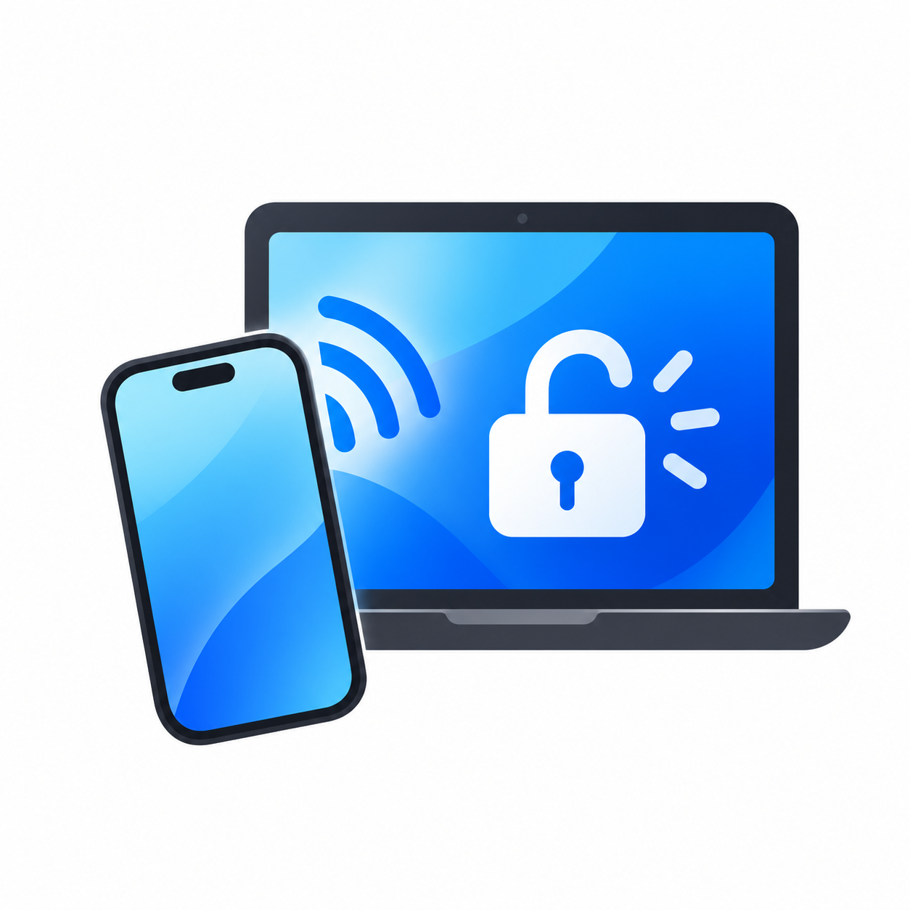

<!-- Created by Rui MA on 26 Sep 2026 -->
> [!WARNING]
> **Developer technical preview**
>
> - **The iOS app requires your own signing.** It is not yet available on the App Store or TestFlight. Download the unsigned IPA from [Releases](https://github.com/dennis6481/unlock-windows-with-iphone/releases) and sign it yourself, or build and sign it using a Mac and Xcode. See the [iOS development guide](ios/README.md).
> - **Currently supports only Windows users who sign in with a Microsoft account (MSA).** The account must have a password. Local Windows accounts are not supported. See Microsoft's guide to [switching from a local account to a Microsoft account](https://support.microsoft.com/en-us/accounts-billing/manage/change-from-a-local-account-to-a-microsoft-account-in-windows).


<p align="center">
  
</p>

<p align="center">
  <a href="https://github.com/dennis6481/unlock-windows-with-iphone/releases">
    
  </a>
  <a href="https://buymeacoffee.com/dennis6481">
    
  </a>
</p>

# Unlock with iPhone®

Unlock Windows session using your iPhone in proximity.

## Get started

### System requirements

The *Unlock with iPhone* requires Windows 10 version **1809, build 17763**, or later, including Windows 11. Both x64 and ARM64 architecture are supported (althought the app has not yet been tested on a physical ARM64 machine).

Your PC must have Bluetooth enabled, with an adapter and driver that support **Bluetooth Low Energy (BLE) peripheral advertising**.

The *Unlock PC* iOS app requires iOS 26 or later, and currently only supports iPhone and iPhone Duo. 


## What it does

- Unlock your locked Windows session using your paired iPhone over Bluetooth. Select the phone unlock tile on the Windows lock screen; your iPhone responds automatically when its configured conditions are met.
- Adjust the proximity setting on your iPhone to control how close it needs to be to respond.
- Keep an encrypted copy of your Microsoft account password on your PC. Your password is never sent to your iPhone.
- Manage pairing, the saved password and connection status from the Windows tray app.
- Install, update or remove the Windows app using its installer.

After restarting your PC or signing out, sign in once with your usual Windows password or PIN before using iPhone unlock again.

### Installation

1. Download the unsigned *Unlock PC* IPA from [Releases](https://github.com/dennis6481/unlock-windows-with-iphone/releases) and sign it before installing, or build and run the app from `ios/` with Xcode. Choose the Windows installer from the same release so both apps use the same revision.
2. Get the latest Unlock with iPhone [Windows installer](https://github.com/dennis6481/unlock-windows-with-iphone/releases) at GitHub release and follow the steps in installer. After restarting, sign in once with your usual Windows password or PIN. iPhone unlock is available only for subsequent unlocks of that session. When the installation result page appears, choose **Start setup** to continue.

3. You will need to enter your **Microsoft account** password. This password will be ecrypted and store on your PC. (For the moment you have to be logged in with your Microsoft account to use the app. Local account support will be added later).

4. On iPhone's *Unlock PC* app, tap *Add a Windows PC*, and *Continue*, than you should see your PC name under the SHA fingerprint.

5. On your PC, verify that the SHA 256 fingerprint matches the one on iPhone, than click *Confirm*. You will see a confirmation page on your iPhone and you're all set.

## Uninstall

Open Windows **Settings → Apps**, find *Unlock with iPhone* and select **Uninstall**. Follow the uninstaller's instructions, including restarting if prompted.

Uninstalling removes the Windows components, the Start Menu shortcut, the saved password copy and the iPhone pairing information stored on your PC. It does not change your Microsoft account password. If you reinstall, you will need to set up the app again.

The PC entry in the iPhone app is kept. You can remove it separately from *Unlock PC*.

## Repository guide

```text
.
├── ios/           SwiftUI app, CoreBluetooth coordination, Secure Enclave signing and pure policy tests.
├── windows/       Desktop app, credential service, Credential Provider, installer, shared code and C++ tests.
├── docs/
│   └── Testing.md Reproducible checks and release evidence requirements.
├── PROTOCOL.md    Cross-platform protocol and overall architecture.
└── SECURITY.md    Credential protection, security assumptions and limitations.
```

The [Windows module index](windows/README.md#module-index) explains the source directories. Source modules are not separate installed programs.

## Build and set up

- [Windows: prerequisites, build, installation and setup](windows/README.md)
- [iOS: Xcode signing, device installation and app settings](ios/README.md)
- [Testing and diagnostics](docs/Testing.md)

Build both platforms from the same revision. Do not mix service, Credential Provider and desktop binaries from different builds. A iOS simulator can be useful for UI work, but cannot exercise the Secure Enclave signing path.

Windows distribution is a single `windows/dist/UnlockWithIPhone_<version>_<architecture>_setup.exe` with the desktop app, service and Credential Provider embedded. 


## Known limitations

- **Distribution:** There is no App Store or TestFlight distribution. Release builds provide an unsigned IPA that requires your own signing before installation.
- **Windows sessions and accounts:** Currently, only Microsoft Account (MSA) accounts are supported; local Windows accounts are not supported. Account changes or an outdated saved password can cause native authentication to fail.
- **Multi-users:** The Windows app does not currently support multi-users. I can only be configured for one MSA user on the PC.


The testing guide describes how to report results without treating a successful normal-path trial as full acceptance.

## To Do

- [ ] Modernize the Windows UI and setup guidance
- [ ] Support multiple Windows users.
- [ ] Support local Windows accounts.
- [ ] Integrate iOS AccessorySetupKit.
- [ ] watchOS supported.
- [ ] Move Windows installer packaging to an MSI architecture.
- [ ] Investigate LSA-based Windows authentication to replace the current implementation that stores a local Windows password copy.

## Security

Inspired by the fact that an Apple Watch can unlock a Mac seemlessly, the software is an exploration for the possibility to unlock Windows PC with an iPhone (or Apple Watch). Therefore this is not a commercial or professional secutity solution. I will deny all the liabilities in case of security breach. 
Please refer to [SECURITY.md](SECURITY.md) for more details.

## Contributions

A contribution is welcome. Feel free to open an issue if you would like to continue where I've left off, or simply if you found some bugs, or some improvements.

## License and acknowledgements

The project uses the [MIT License](LICENSE.md). This is an independent project; product names identify the platforms it works with.

## References

- [Apple: Protecting keys with the Secure Enclave](https://developer.apple.com/documentation/security/protecting-keys-with-the-secure-enclave)
- [Apple: Core Bluetooth background processing](https://developer.apple.com/library/archive/documentation/NetworkingInternetWeb/Conceptual/CoreBluetooth_concepts/CoreBluetoothBackgroundProcessingForIOSApps/PerformingTasksWhileYourAppIsInTheBackground.html)
- [Microsoft: Credential Providers](https://learn.microsoft.com/en-us/windows/win32/secauthn/credential-providers-in-windows)
- [Microsoft: GATT server](https://learn.microsoft.com/en-us/windows/apps/develop/devices-sensors/gatt-server)

- [Microsoft: Credential Provider system user array](https://learn.microsoft.com/en-us/windows/win32/api/credentialprovider/nf-credentialprovider-icredentialprovidersetuserarray-setuserarray)
- [Microsoft: MSBuild for Visual C++](https://learn.microsoft.com/en-us/cpp/build/msbuild-visual-cpp)
- [Microsoft: /MD and /MT runtime linkage](https://learn.microsoft.com/en-us/cpp/build/reference/md-mt-ld-use-run-time-library)
- [Microsoft: Finding and loading resources](https://learn.microsoft.com/en-us/windows/win32/menurc/finding-and-loading-resources)
- [Unlock PC: Privacy Policy](https://dennis6481.github.io/unlock-windows-with-iphone/)
